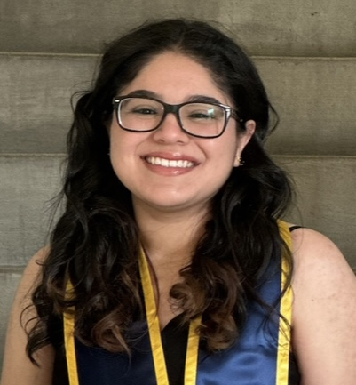

<figure class="image-left" style="padding-top: 10px;">
    
    <figcaption>
        <h3 style="padding-top:60px">Alyssa Ortega</h3>
        
aortega59@ucmerced.edu

</figure>

### Research Interests
Broadly, I am interested in how gesture can be employed as a technique to boost learning. How is gesture used to inspire new insights? In what ways can gesture help people to learn new word meaning or mathematical concepts? I am also interested in investigating the limitations of gesture by asking questions like (i) does the helpfulness of gesture vary across the lifespan and/or across culture and (ii) what is the duration of effect from gesture-based learning.

### Academic Bio

I am currently the full time manager of two labs at the [University of California, Merced](https://cogsci.ucmerced.edu) where I recently graduated with a B.A. in Psychology & Cognitive Science. I now work in the Cognitive & Information Sciences department under [Dr. Tyler Marghetis](https://www.tylermarghetis.com/) and [Dr. Rachel Ryskin](https://linclab0.github.io) studying topics ranging from creativity, embodied cognition, and language processing. In these labs, I utilize a variety of methods such as behavioral experimentation, EEG, and naturalistic observation & analysis.

In Fall 2024, I will begin my doctoral studies in Cognitive Psychology at the University of Wisconsin - Madison, studying under [Dr. Martha Alibali](https://alibali.psych.wisc.edu/).

