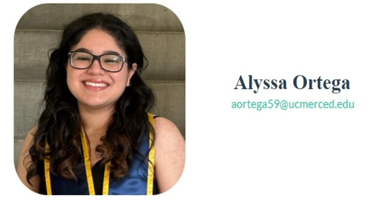

  

### Research Interests
Broadly, I am interested in how gesture can be employed as a technique to boost learning. How is gesture used to inspire new insights? Can gesture help people to  learn new word meaning or even aquire a second language? Does the helpfulness of gesture vary across the lifespan and/or across cultures? Are the effects of using gesture as a tool long or short lasting?

### Academic Bio

I am currently the full time manager of two labs at the [University of California, Merced](https://cogsci.ucmerced.edu) where I recently graduated with a B.A. in Psychology & Cognitive Science. I now work in the Cognitive & Information Sciences department under [Dr. Tyler Marghetis](https://https://www.tylermarghetis.com/) and [Dr. Rachel Ryskin](https://linclab0.github.io) studying topics ranging from creativity, embodied cognition, and language processing. In these labs, I utilize a variety of methods such as behavioral experimentation, EEG, and naturalistic observation & analysis.

I am also in the process of applying to Cognitive Science & Psychology PhD programs for the Fall 2023 cycle.

